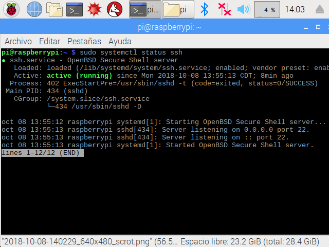
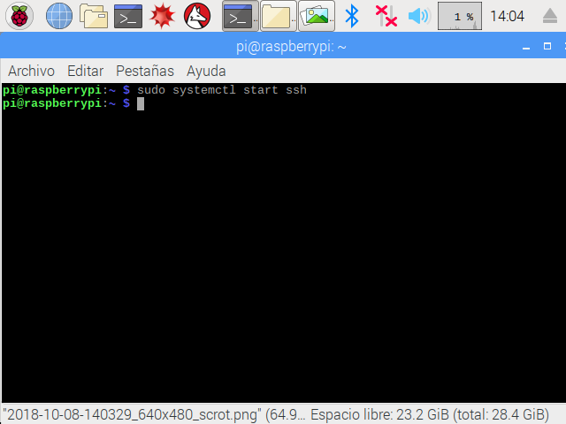
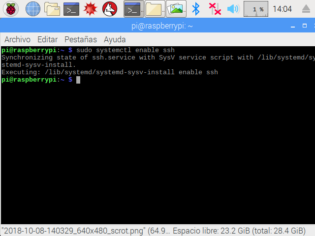
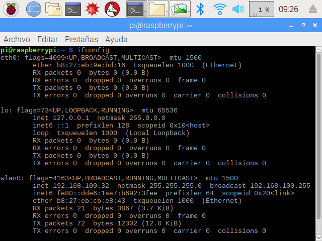

							#INSTITUTO POLITECNICO NACIONAL.<h1>
							##ESCUELA SUPERIOR DE CÓMPUTO.<h2>

							###Título: Uso de las RaspberryPi 3.<h3>

										Alumnos: 
							Angel Miranda Pedro.
							Gonzale Ambris Luis Angel.
							Materia:  Embedded Systems.

							Grupo: 4CM3.

							Profesor: García Ortega Víctor Hugo.

SSH

Para verificar la  lista  de  servicios  disponible  y  su  estado ejecutamos los comandos siguientes podrás  observar  que  el  servicio  esta  activo  por  lo  que  ya se inicializo  .
--sudo  systemctl  status  ssh

--sudo  systemctl  start  ssh

--sudo  systemctl  enable  ssh

Verifica  el  nombre  de  la  interfaz  de  red  inalámbrica  en  tu  raspberry  y  anota  la  dirección  MAC.Ejecuta  el  comando:
--ifconfig

Determinar  la  dirección  ipasignada  por  el  router  WIFI  a  la  tarjeta  RaspberryPi  3.

Finalmente  ejecutar  la  conexión  con  el  comando  ssh.  Si  la  dirección  IP  asignada  a  nuestratarjeta  RaspberryPi  3  fuera 192.168.100.13 tendríamos:
--ssh  pi@192.168.100.13  (user y password)

Usando la  RaspberryPi  3  mediante  VNC.

$  sudo  systemctl  status  vncserver-x11-serviced

$  sudo  systemctl  start  vncserver-x11-serviced

$  sudo  systemctl  enable  vncserver-x11-serviced

$  sudo  apt-get  install  realvnc-vnc-viewer

  Usando  la  RaspberryPi  3  mediante  consola.
$sudo  nano /boot/config.txt

Agregamos  al  final  las  sentencias  de  habilitación  del  mini-UART  y  la  configuración  de  suoscilador  de  250  Mhz  para  el  cálculo  de  la  velocidad  de  transmisión  en  baudios.
enable_uart=1
core_freq=250

En  nuestra  computadora  personal  conectamos  el  módulo  FT232  y  verificamos  el  nombre  dedispositivo  asignado,  normalmente  es  ttyUSB0.
$  ls  -l  /dev/ttyUSB0

Verás  algo  como  esto:  “crw-rw----T  1  root  dialout  ...”,  la  letra  c  significa  que  es  un  dispositivode  carácter,  root  puede  leer  y  escribir,  el  grupo  dialout  puede  leer  y  escribir,  todos  los  demásno  tienen  acceso.  Debemos  ser  parte  del  grupo  dialout  para  poder  comunicarnos  con  elmódulo  FT232.
$ id
Si  no  aparece  el  grupo  dialout  en  la  lista  debemos  agregarnos  al  grupo  con:
$  sudo  usermod  -a  -G  dialout  “$(whoami)”

Entonces  podemos  conectar  nuestra  computadora  personal  con  GNU  screen.  Screen  es  unprograma  que  permite  administrar  ventanas  multiplexando  una  terminal  física  entre  variosprocesos.  Con  screen  podemos  realizar  la  conexión  a  nuestra  tarjeta  Raspberry  usando  lacomunicación  UART.  La  conexión  la  realizamos  con  el  comando  screen  epecificando  eldispositivo  al  que  nos  vamos  a  conectar  y  la  velocidad  de  comunicación:
$  screen  /dev/ttyUSB0  115200

En  este  instante  tenemos  que  reniciar  nuestra  tarjeta  RaspberryPi  3.  
$  sudo  reboot