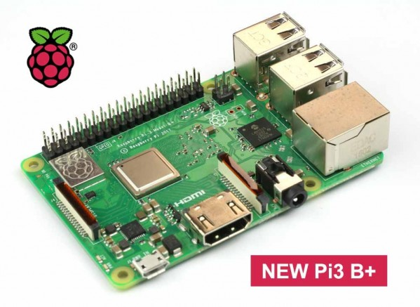

Instituto Politécnico Nacional
ESCOM
Escuela Superior de Computo

Integrantes:
García Cebada Jorge Miguel
Amador Nava Miguel Ángel

Materia: Embedded Systems
Profesor: Victor Hugo García Ortega
Grupo: 3CV10

