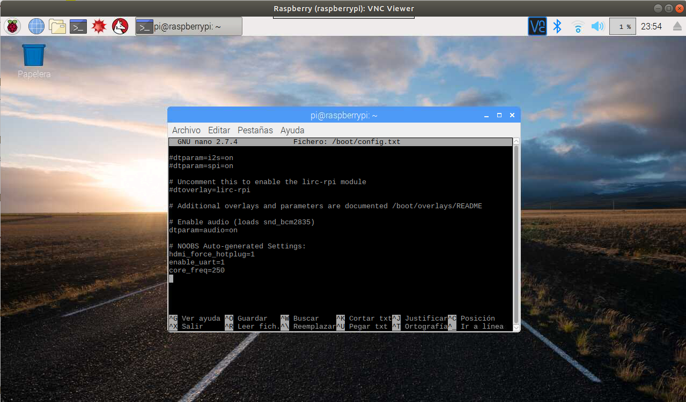

Instituto Politécnico Nacional  
ESCOM  
Escuela Superior de Computo  

Integrantes:  
García Cebada Jorge Miguel  
Amador Nava Miguel Ángel  

Materia: Embedded Systems  
Profesor: Victor Hugo García Ortega  
Grupo: 3CV10  

  
  
Escritorio Raspberry:  
  

Métodos de conexión  

Conexión de Red  

$ sudo nano /etc/wpa_supplicant/wpa_supplicant.conf  

  

1. Conexion SSH  

En la Raspberry:

$ sudo systemctl status ssh  
$ sudo systemctl start ssh  
$ sudo systemctl enable ssh  

  

En la computadora  

$ nmap -p22 192.168.1.0/24  

  

Teniendo el valor de la ip de la raspberry 192.168.1.74 (siendo la ultima valida en la lista nmap).  

$ ssh pi@192.168.1.74  

  

2. Conexion VNC  

En la Raspberry:  

$ sudo systemctl status vncserver-x11-serviced  
$ sudo systemctl start vncserver-x11-serviced  
$ sudo systemctl enable vncserver-x11-serviced  

  

En la computadora:  
  
Instalar VNC Connect en la computadora  

Correr el programa y crear nueva conexión, ingresando los datos pertinentes:  

  

  

  

3. Conexion UART  

En la Raspberry:  

$ sudo nano/boot/config.txt

enable_uart=1
core_freq=250

  

En el Hardware:  

  

  

En la computadora:  

$ ls -l /dev/ttyUSB0  
$sudo usermod -a -G dialout "$(whoami)"  
$ sudo screen/dev/ttyUSB0 115200  

  

Al resetear la Raspberry:  

  

