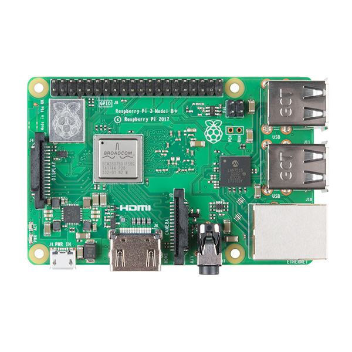
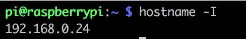
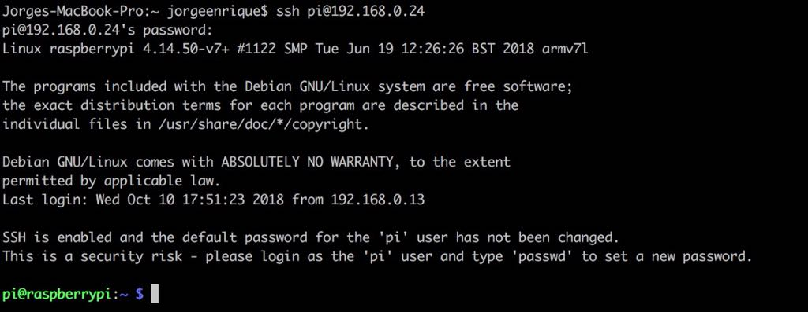
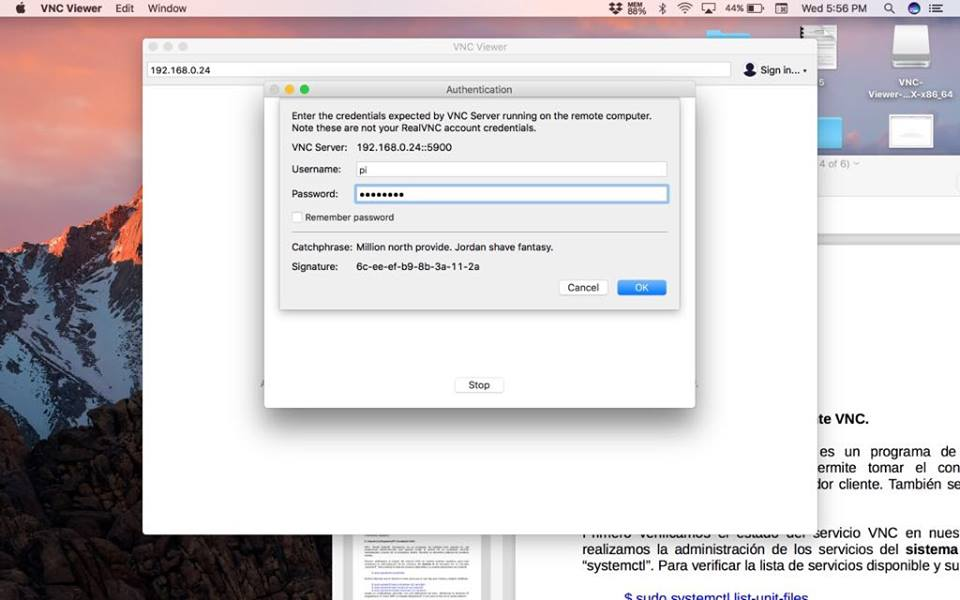
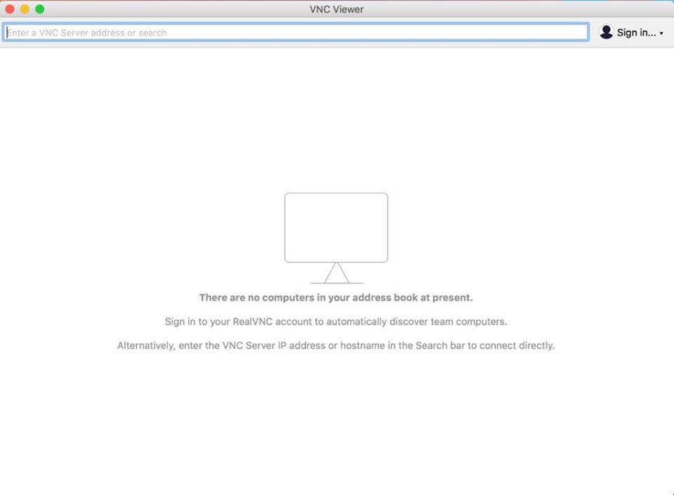
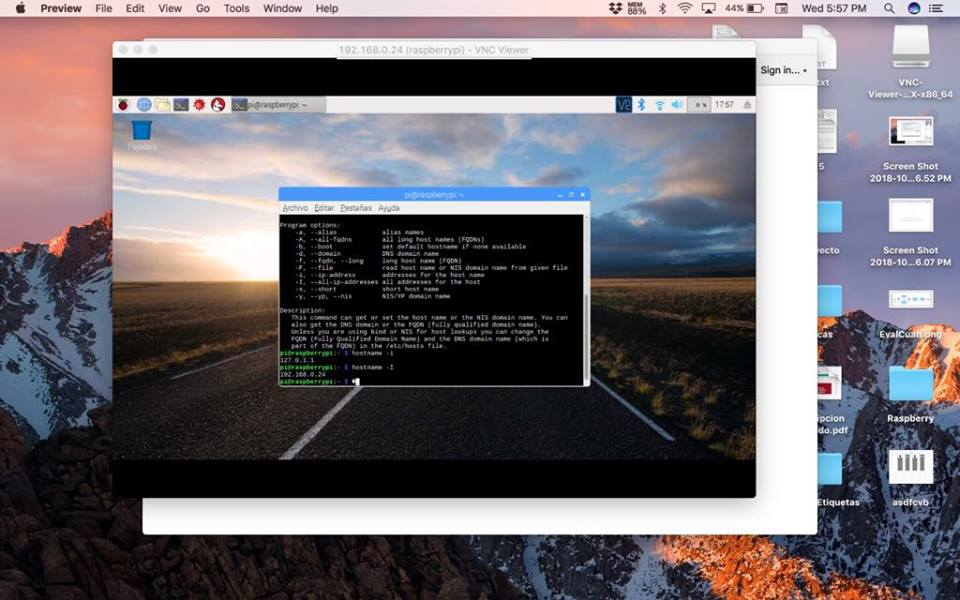
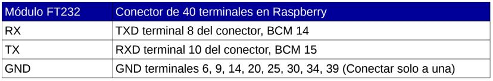
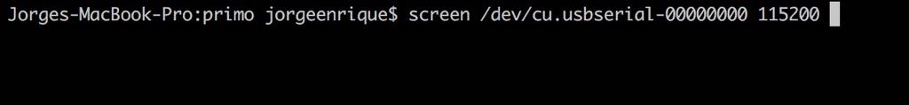
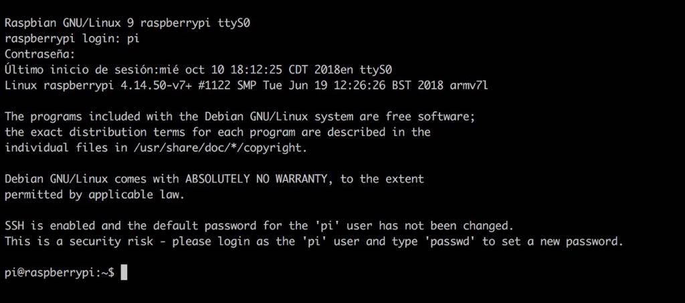

# INSTITUTO POLITÉCNICO NACIONAL 
# ESCUELA SUPERIOR DE CÓMPUTO 

## EMBEDDED SYSTEMS
## _Reporte RaspberryPi 3_ 



### Pre-requisitos 📋

_Memoria  micro  SD  clase  10  de  almenos  8Gb_

_Cargar sistema operativo_

```
 Sistema  operativo  Raspbian  Stretch  de  4.9  Gb
```
### Instalación 🔧

_Insertamos la memoria a la computadora_

_Ejecutamos una serie de comandos para montar el Sistema Operativo_

_$  lsblk_

```
Verificamos  el  nombre  de  dispositivo  asignado  ala  memoria,  así  como  las  particiones.
```

_$  sudo  umount  /dev/sdc1_

```
Desmontamos todas las  particiones  de  nuestra  memoria  SD.
```
_$  sudo  dd  bs=4M  if=2017-11-29-raspbian-stretch.img  of=/dev/sdc  conv=sync_

```
Hacemos  la  copia  de  la  imagen  del  sistema  operativo  a  la  memoria  micro  SD.
```
_$  sync_

```
Limpiamos  la  memoria  cache  para  desmontar  la  memoria  micro  SD
```

## RaspberryPi 3 como computadora de escritorio. 🚀

_Para este  modo  de  operación  conectamos un monitor mediante  una  cable  HDMI,  un teclado  y un ratón.  Después  conectamos  el  eliminador  y  esperamos  al  arranque  del sistema  operativo._

_Debimos configurar la interfaz de red Inalambrica (WIFI), haciendo lo siguiente._

_$  sudo  nano /etc/wpa_supplicant/wpa_supplicant.conf_

```
Especificamos el archivo para la configuración del router al que nos conectamos.
```

_network={ssid="Tenda_80AFF0"key_mgmt=NONE}_

```
Agregamos nuestro router al archivo.
```
_$  sudo  reboot_

```
Reiniciamos nuestro sistema. 
```

## RaspberryPi  3  mediante  SSH ⚙️

_SSH.  Secure  shell,  es  un  protocolo  de  red  que  permite  el  intercambio  de  datos  sobre  uncanal  seguro  entre  dos  computadoras._

_$  sudo  systemctl  list-unit-files_

```
Checamos la lista de servicios disponibles (SSH) y su estado 
```

_$  sudo  systemctl  status  ssh_

```
Ahora checamos el estado del servicio SSH 
```

_$  sudo  systemctl  start  ssh_

```
Al ver que no Esta activo lo iniciamos
```

_$  sudo  systemctl  enable  ssh_

```
Aqui lo habilitamos 
```
_$  ifconfig_

```
Determinamos el nombre de la interfaz de red y anotamos la dirección MAC. 
```
```
Con esto se termina esta parte
```
* ** Ahora vamos a pasar a nuestra computadora personal 


_$  hostname  -I_

```
Determinamos la derecci{on IP (192.168.0.24)
```
_$  nmap  -p22  192.168.0.0/24_

```
Peguntar  por  las direcciones  IP  dentro  de  la  red  que  tengan  el  puerto  22  abierto,  

este  puerto  es  el  del  SSH,  es decir,  vamos  a  hacer  un  mapeo  de  la  red  con  la  herramienta 

nmap
```

_$  arp  -v  |  grep  da:73_

```
Ejecutamos  el  protocolo  de  resolución  de  direcciones  con  el  comando  ARP  y verificamos 

contra  la  dirección  MAC  de  nuestra  tarjeta  RaspberryPi  3.  Podemos  filtrar  la búsqueda 

con  el  comando  grep,  colocando  los  dos  últimos  bytes  de  la  dirección  MAC. 
```

_$  ssh pi@192.168.0.24_

```
Ejecutamos la conexion SSH en nuestro caso, con usuario pi y contraseña raspberry  
```

```
Finalmente inicia el sistema mediante SSH.
```

### Capturas de resultado 🔩



* ** Entrar mediante SSH 

## RaspberryPi  3  mediante  VNC ⌨️

_VNC.  Virtual  Network  Computing,  es  un  programa  de  software  libre  basado  en  unaarquitectura  cliente-servidor  que  permite  tomar  el  control  de  un  ordenador  servidorremotamente  a  través  de  un  ordenador  cliente.  También  se  denomina  software  de  escritorioremoto._

_$  sudo  systemctl  list-unit-files_

```
Checamos la lista de servicios disponibles (VNC) y su estado 
```

_$  sudo  systemctl  status  vncserver-x11-serviced_

```
Ahora checamos el estado del servicio SSH 
```
_$  sudo  systemctl  start  vncserver-x11-serviced_

```
Al ver que no Esta activo lo iniciamos
```
_$  sudo  systemctl  enable  vncserver-x11-serviced_

```
Aqui finalmente lo inicializamos 
```
Lo probamos con la aplicación VNC Viewer para MAC. 

```
Finalmente inicia el sistema mediante VNC.
```

### Capturas de resultado 🔩




* ** Entrar mediante VNC 

## RaspberryPi  3  mediante  Consola 📌

_¿Qué  pasa  si  no  cuento  con  teclado,  monitor  y  ratón  para  usar  mi  tarjeta  Raspberry  comocomputadora  de  escritorio  y  tampoco  tengo  conexión  en  red  para  conectarme  con  SSH  o VNC?_

_Conectarnos  a  nuestra  tarjeta  Raspberry  mediante  UART_

_$  sudo  nano /boot/config.txt_

```
Habilitamos  el  mini-UART  de  la  tarjeta  RaspberryPi  3,  esto  lo  hacemos  en  

el archivo  de  configuración  para  el  kernel
```
_enable_uart=1 core_freq=250_

```
Agregamos  al  final  las  sentencias  de  habilitación  del  mini-UART  y  la  

configuración  de  su oscilador  de  250  Mhz  para  el  cálculo  de  la  

velocidad  de  transmisión  en  baudios.
```
* ** Conetamos nuesto módulo a la Raspberry 


_$  ls  -l  /dev/cu.usbserial-00000000_

```
verificamos  el  nombre  del dispositivo  asignado
```
_$  id_

```
Verificamos que seamos parte del grupo dialout, para poder comunicarnos.
```
_$  sudo  usermod  -a  -G  dialout  “$(whoami)”_

```
Nos agregamos al grupo dialout 
```
_$  screen  /dev/cu.usbserial-00000000  115200_

```
Se usa para conectar nuestra computadora personal con GNU screen, especificando a que 

dipositivo nos vamos a conectar y a que velocidad.
```
_$  sudo  reboot_

```
Reiniciamos la raspberry. 
```

```
Finalmente inicia el sistema mediante consola.
```
### Capturas del proceso 📦



## Autores ✒️

* **López Rivera Aiko Dallane** - *Documentación* - [MikeyMcDon](https://github.com/MikeyMcDon)
* **Maldonado Carpio Jorge Enrique** - *Documentación* - [JorgeEnrique12](https://github.com/JorgeEnrique12)

## Victor Hugo García Ortega ❤️⌨️ 

* **Profesor** [Victor Hugo García Ortega](https://github.com/vgarciaortega)

